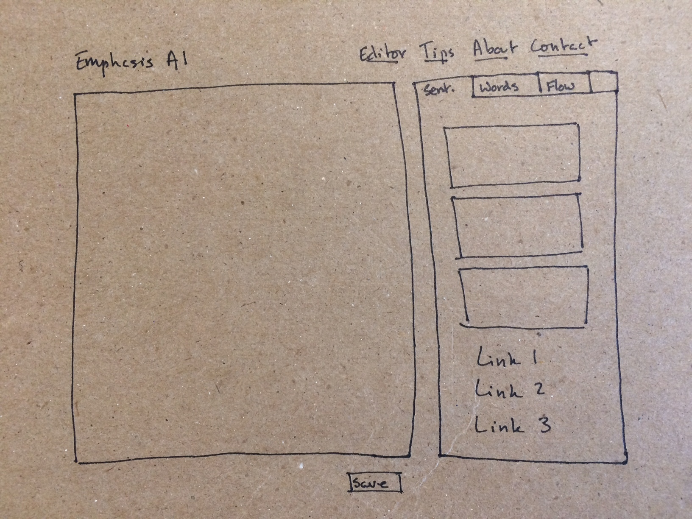

# emphasis_editor
A new editor for emphasis.ai

## Why a new editor?
Emphasis AI needs a new text editor with more functionality and a better user experience.

## User Stories
Users will be able to register as users and log in. They will have a user profile with basic profile information as well as a list of entries. Once users log in, they will be redirected to the editor page. This page will have a contenteditable div. Users will be able to enter text input in this div. Their input will be sent to the Emphasis API. The data returned by Emphasis AI will be used to highlight the text input so that patterns of sentence-level emphasis are evident.

Users will have the ability to save their writing as an entry. They will also be able to delete their entries as well as their user account.

To the right of the contenteditable div, there will be a series of tabs. By clicking on a tab, the user will access a different form of emphasis analysis. Users will be able to select a sentence-level emphasis tab, a word-order emphasis tab, or a flow tab. Initially, only sentence-level emphasis will be available.

## Wireframe

## Technologies
The following technologies were used to build the Emphasis Editor:
- React
- react-contenteditable
- Node
- Express
- MongoDB

## Back End: Personal Entries Database
When users click the save button at the bottom of the contenteditable div, their entry will be stored in a database. That database will be private. Users will only be able to access their entries from their profile page on the Emphasis Editor. This database will be separate from Emphasis DB.
